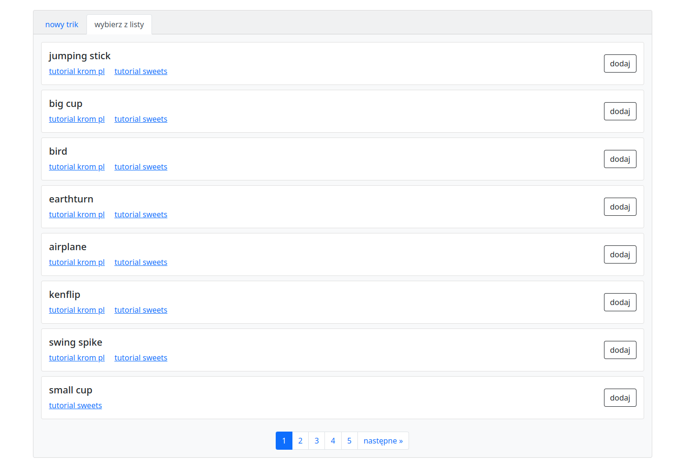
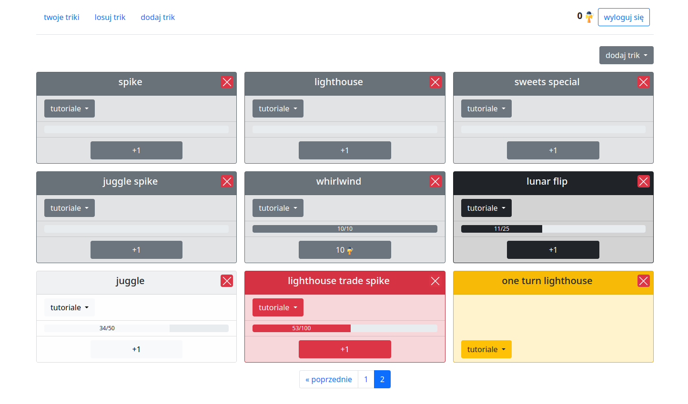
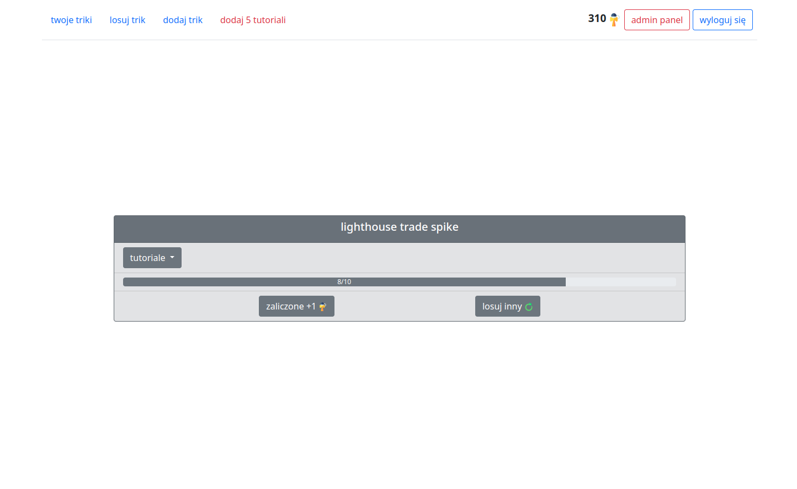

# kendama-progress-tracker

An app that allows you to practice kendama and have more fun doing that. You can track how many times you land a trick, level up and get points.

- https://your-kendama-trainer.herokuapp.com/

## How to use it

First, register yourself. Then go to your mailbox and click a link that we sent, to verificate your email address.

Once you're logged in, you can go to 'dodaj trik' page by clicking it on the navigation. You'll see a list of tricks you can add to your personal list of tricks. Check tutorials, choose tricks you want to practice on and click 'dodaj' to add them to your list. If you want to practice on a trick that is not here, go to 'nowy trik', fill a form and a new trick (other users will not see it).

To see your list of tricks go to 'twoje triki'. As you can see below, there are five different levels you can get on a trick:

- cobblestone - entry level,
- coal - if you land the trick 10 times,
- iron - if you land the trick 25 times,
- redstone - if you land the trick 50 times,
- gold - if you land the trick 100 times.

The rule is simple - once you land a trick, click '+1'. After you fill up a progress bar of the trick, you can level up and get 10 kendama points. The goal is to land every trick 100 times and get a gold level.

There is also a 'losuj trik' page, where you can practice on random tricks. It's a great solution if you don't want to wonder what trick you should do now. If you land the trick, then click 'zaliczone', but if you're stucked and want to move on, you can click 'losuj inny' to draw another random trick. For every landed trick you get a kendama point so it's like a farm of points.

## Technologies

- Python 3.10
- Django 4.0
- Bootstrap 5
- Docker 20.10

## Project status 💀

The project has been abandoned because the technology stack doesn't work well with this kind of app. However I want to make a second version with better user experience in future.
